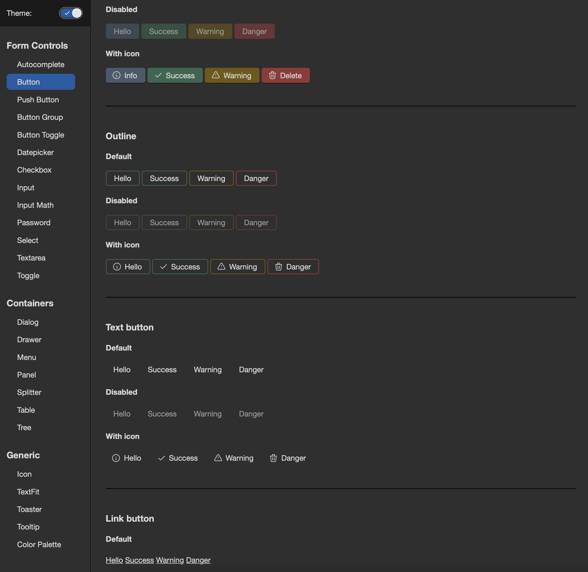

simple-ui-components-in-svelte
==============================

A set of simple, but perfect, UI components, written in Svelte (the only front-end framework worth learning).

### Github pages site with docs
https://perfect-things.github.io/simple-ui-components-in-svelte/




### TODO
- [ ] upgrade dialogs? (https://web.dev/building-a-dialog-component/)

- [ ] Bug: toggle doesn't work on mobile
- [ ] Bug: splitter doesn't work on mobile


- [ ] color palette
  - reduce text & bg
  - colors
  - text-primary, secondary
  - rm semi, etc


## Install & Setup

### Firstly, install the module as a dev dependency:
```sh
npm i -D simple-ui-components-in-svelte
```

### Importing the CSS
You need to import the `docs/ui.css` into your bundle.
There are many ways to do that. I specifically didn't use any css-to-js imports as these restrict the tools & the setup you may want to have.

The easiest way is probably to add a `postinstall` script into your `package.json` that will just copy the file into your `dist` folder:
```sh
...
"postinstall": "cp node_modules/simple-ui-components-in-svelte/docs/ui.css ./dist/ui.css"
...
```
From there - you can just add it directly to the `index.html`.

### Svelte components
Just `import` them from the module, as normal:
```js
import { Button } from 'simple-ui-components-in-svelte';
```


## Development

You need node & npm (obviously). Run these:
```sh
git clone git@github.com:perfect-things/simple-ui-components-in-svelte.git
cd simple-ui-components-in-svelte
npm i && npm start
```
A browser window should open with the demo of the components.


## Resources
- icons: https://tablericons.com
- https://developer.apple.com/design/human-interface-guidelines/components/


## Support me
<a href="https://www.buymeacoffee.com/tborychowski" target="_blank"></a>
<br>
<a href="https://liberapay.com/tborychowski/donate"></a>
